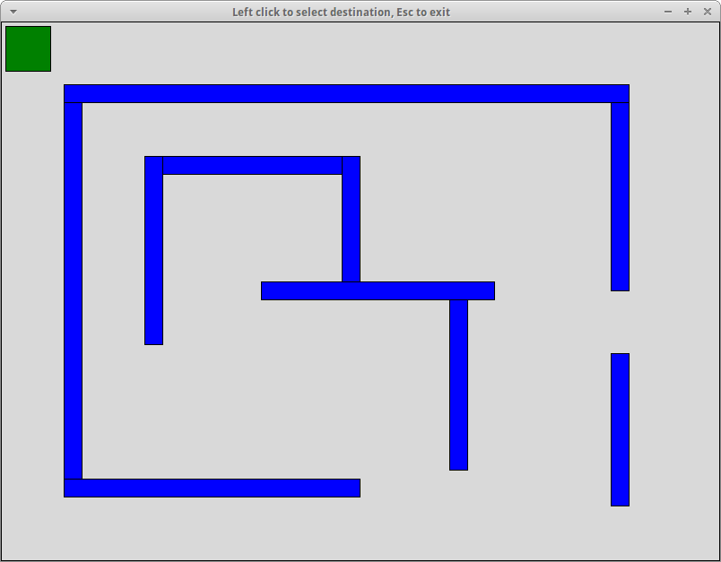

# Pathfinder

A simple motion planning program. It uses a [visibility graph](https://en.wikipedia.org/wiki/Visibility_graph) and [A* search algorithm](https://en.wikipedia.org/wiki/A*_search_algorithm). Results are cached to speed up calculations.

The program assumes that all objects (both the Agent and the obstacles) are represented as axis-aligned rectangles. It consists of two files:
* **pathfinder.py** Contains actual pathfinding algorithm and all necessary data structures
* **pathfinder_gui.py** Contains a simple GUI with a set of obstacles and one Agent

More information about motion planning can be found [here](http://www.gamasutra.com/blogs/MatthewKlingensmith/20130907/199787/Overview_of_Motion_Planning.php). Computing the intersection of a line with an obstacle was based on [this publication](http://www.cs.utah.edu/~shirley/books/fcg2/rt.pdf). 
